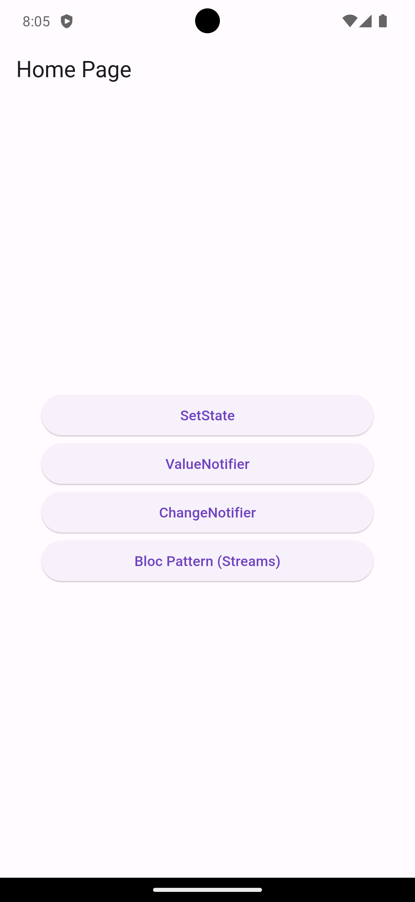
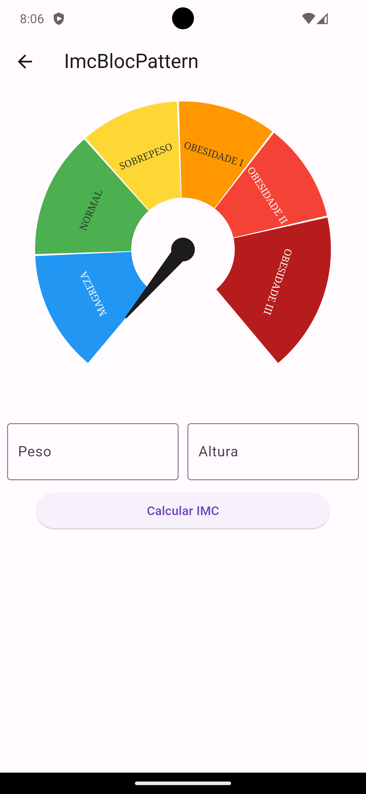

# State Management - BMI Calculator

 State Management Project project is a mobile application designed to calculate Body Mass Index (BMI) using various native state management approaches provided by Flutter: setState, ValueNotifier, ChangeNotifier, and the Bloc Pattern with Streams.

Screenshots:

My HomePage:

<br>

Page Calculator:



## Index

1. [Features](#features)
2. [State Management Approaches](#state-management-approaches)
3. [Instalation](#instalation)
4. [How To Use](#how-to-use)
5. [Contribution](#contribution)
6. [License](#license)

## Features
BMI Calculation: Users can input their height and weight to calculate their BMI instantly.
Weight Status: The application provides information about the weight status based on the calculated BMI value, such as underweight, normal weight, overweight, or obesity.
Native State Managers: Utilizes different native state management approaches provided by Flutter, including setState, ValueNotifier, ChangeNotifier, and the Bloc Pattern with Streams, to manage state efficiently throughout the application.

## State Management Approaches
1. setState: The traditional approach provided by Flutter for managing state within the widget tree.
2. ValueNotifier: Utilizes ValueNotifier to notify listeners when the value changes, updating the UI accordingly.
3. ChangeNotifier: Implements ChangeNotifier along with Provider for simple and efficient state management, particularly useful for small to medium-sized applications.
4. Bloc Pattern with Streams: Implements the Bloc Pattern using Streams for managing complex state and business logic, providing a scalable and maintainable solution for larger applications.


## Instalation

1. **Clone the repository:**

```shell
git clone https://github.com/your-username/your-repository.git
```

2. **Install dependencies:**

Navigate to the project directory and run the following command in the terminal:

```shell
flutter pub get
```


3. **Run the app:**

Make sure an emulator is running or a physical device is connected, and execute:

```shell
flutter run
```

This will start the app on the selected device or emulator.

If you haven't set up the Flutter environment yet, follow the instructions in the [official Flutter documentation](https://flutter.dev/docs/get-started/install) to set it up before proceeding with the above steps.

## How To Use

1. **Input your weight and stature:**

Once the app is running, input your 
weight (in kilograms) 
and stature(in meters) in the respective fields.

2. **View your BMI Animation:**

After inputting your height and weight, your BMI will be calculated automatically. You'll see your BMI value along with information about your weight status below the input fields.

Feel free to explore different state management approaches used in the app by checking out the corresponding branches or sections of the codebase.


## Contribution

Contributions are welcome! If you'd like to contribute to this project, feel free to submit a pull request with your changes.

## License

MIT License

Copyright (c) [2024] [Cdrd.dev]

Permission is hereby granted, free of charge, to any person obtaining a copy
of this software and associated documentation files (the "Software"), to deal
in the Software without restriction, including without limitation the rights
to use, copy, modify, merge, publish, distribute, sublicense, and/or sell
copies of the Software, and to permit persons to whom the Software is
furnished to do so, subject to the following conditions:

The above copyright notice and this permission notice shall be included in all
copies or substantial portions of the Software.

THE SOFTWARE IS PROVIDED "AS IS", WITHOUT WARRANTY OF ANY KIND, EXPRESS OR
IMPLIED, INCLUDING BUT NOT LIMITED TO THE WARRANTIES OF MERCHANTABILITY,
FITNESS FOR A PARTICULAR PURPOSE AND NONINFRINGEMENT. IN NO EVENT SHALL THE
AUTHORS OR COPYRIGHT HOLDERS BE LIABLE FOR ANY CLAIM, DAMAGES OR OTHER
LIABILITY, WHETHER IN AN ACTION OF CONTRACT, TORT OR OTHERWISE, ARISING FROM,
OUT OF OR IN CONNECTION WITH THE SOFTWARE OR THE USE OR OTHER DEALINGS IN THE
SOFTWARE.
